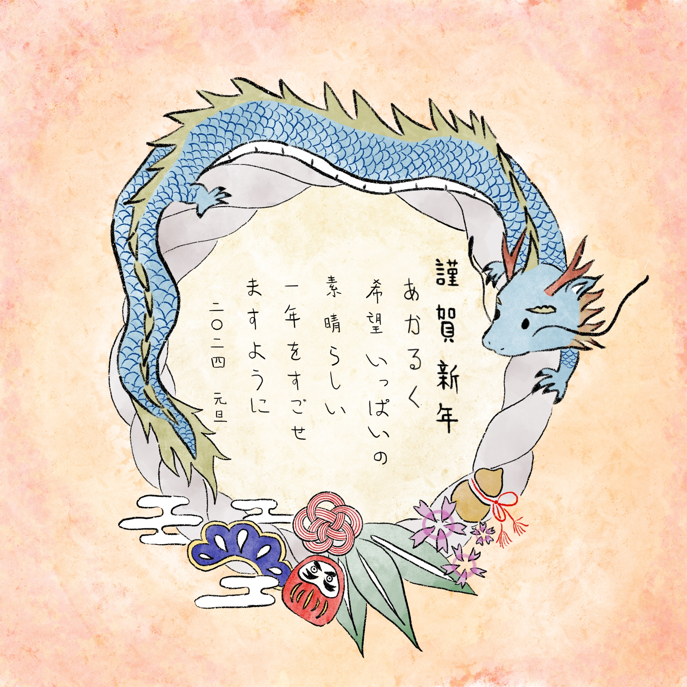

# 🎨 My Art Journey

---

## 🎍 Nengajo Collection
Since 2020, I have been drawing a "Nengajo" (New Year's card) every year. This is a tradition I cherish to mark the beginning of each year.

| Year | Zodiac (干支) | Illustration |
|:---:|:---:|:---:|
| **2025** | **Snake** (巳 - み) |  |
| **2024** | **Dragon** (辰 - たつ) |  |
| **2023** | **Rabbit** (卯 - う) |  |
| **2022** | **Tiger** (寅 - とら) |  |
| **2021** | **Ox** (丑 - うし) |  |
| **2020** | **Rat** (子 - ね) |  |

 

### 🖌️ Tools
- Procreate
- Clip Studio Paint
- Hand-drawn
